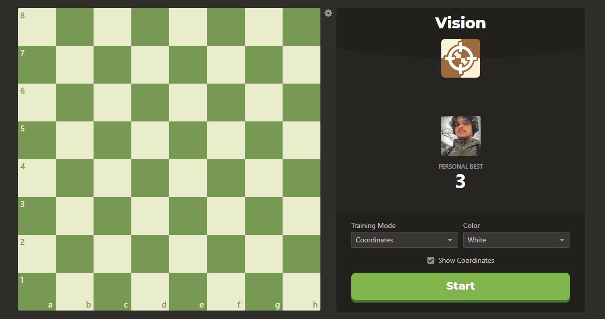
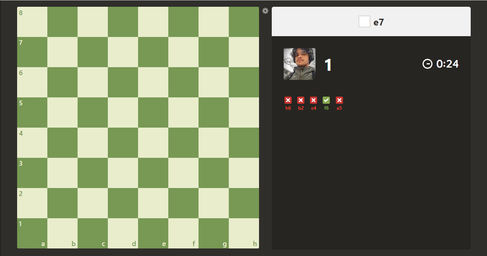

# Vision

This project is based on replicating the mini game Vision from [Chess.com](https://www.chess.com/vision). where player can practice remembering the chessboard positions.

# Rules

-   Players will have 30 seconds to accumulate as many points as possible by selecting the correct box positions. 
-   You will have only one opportunity to click on a box, whether it's the correct one or not. After each click, players will be presented with another random position to guess. 
-   After 30 seconds, you will be able to view your all-time best score and can continue playing.

# Original Game Screenshots

Dashboard Image: 

In-Game Image: 

